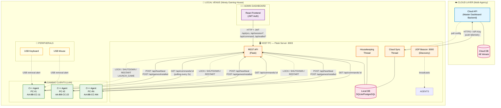

```mermaid
graph TB
subgraph CLOUD["☁️ CLOUD LAYER (Multi-Agency)"]
CLOUD_API["Cloud API<br/>(Master Dashboard Backend)"]
CLOUD_DB[("Cloud DB<br/>All Venues")]
CLOUD_API --- CLOUD_DB
end

    subgraph VENUE["🏢 LOCAL VENUE (Ninety Gaming House)"]
        subgraph HOST["🖥️ HOST PC — Flask Server :8003"]
            API["REST API<br/>(Flask)"]
            UDP["UDP Beacon :9000<br/>(Discovery)"]
            HK["Housekeeping<br/>Thread"]
            SYNC["Cloud Sync<br/>Thread"]
            DB[("Local DB<br/>SQLite/PostgreSQL")]

            API --- DB
            HK --- DB
            SYNC --- DB
            UDP -.broadcasts.-> AGENTS
        end

        subgraph ADMIN["👨‍💼 ADMIN DASHBOARD"]
            REACT["React Frontend<br/>(JWT Auth)"]
        end

        subgraph CLIENTS["🎮 GAMING CLIENTS (LAN)"]
            AGENT1["C++ Agent<br/>PC #1<br/>AA-BB-CC-11"]
            AGENT2["C++ Agent<br/>PC #2<br/>AA-BB-CC-22"]
            AGENT3["C++ Agent<br/>PC #N<br/>AA-BB-CC-NN"]
        end

        subgraph PERIPH["🔌 PERIPHERALS"]
            USB1["USB Keyboard"]
            USB2["USB Mouse"]
        end
    end

    %% Admin → Server
    REACT -->|"HTTP + JWT<br/>/api/pcs, /api/session/*,<br/>/api/command, /api/wallet/*"| API

    %% Server ↔ Cloud
    SYNC -->|"HTTPS + API Key<br/>push telemetry"| CLOUD_API
    CLOUD_API -.->|"pull config"| SYNC

    %% Agents → Server
    AGENT1 -->|"POST /api/heartbeat<br/>POST /api/games/installed"| API
    AGENT2 -->|"POST /api/heartbeat<br/>POST /api/games/installed"| API
    AGENT3 -->|"POST /api/heartbeat<br/>POST /api/games/installed"| API

    AGENT1 -->|"GET /api/commands/:id<br/>(polling every 2s)"| API
    AGENT2 -->|"GET /api/commands/:id"| API
    AGENT3 -->|"GET /api/commands/:id"| API

    %% Server → Agents (via command queue)
    API -.->|"LOCK / SHUTDOWN / RESTART<br/>LAUNCH_GAME"| AGENT1
    API -.->|"LOCK / SHUTDOWN / RESTART"| AGENT2
    API -.->|"LOCK / SHUTDOWN / RESTART"| AGENT3

    %% USB monitoring
    USB1 -.USB removal alert.-> AGENT1
    USB2 -.USB removal alert.-> AGENT1

    %% Styling
    classDef cloud fill:#e1f5ff,stroke:#0288d1,stroke-width:2px,color:#000
    classDef server fill:#fff3e0,stroke:#ef6c00,stroke-width:2px,color:#000
    classDef admin fill:#f3e5f5,stroke:#7b1fa2,stroke-width:2px,color:#000
    classDef client fill:#e8f5e9,stroke:#388e3c,stroke-width:2px,color:#000
    classDef db fill:#fce4ec,stroke:#c2185b,stroke-width:2px,color:#000
    classDef periph fill:#fffde7,stroke:#f9a825,stroke-width:2px,color:#000

    class CLOUD_API cloud
    class API,UDP,HK,SYNC server
    class REACT admin
    class AGENT1,AGENT2,AGENT3 client
    class DB,CLOUD_DB db
    class USB1,USB2 periph
```
